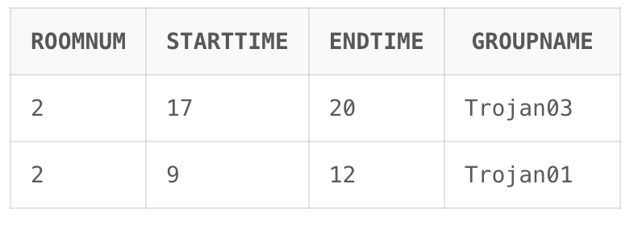

For the first question I have taken several constraints into consideration:
- No student can book slots before 9AM and after 9PM.
- A student may only book a slot for maximum of three hours.
- If slot is already booked, student will be unable to book for that time period.

The queries passed in the Q1.sql file will have the folowing output:
