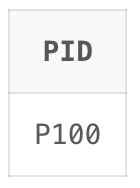

Here's how this query works:

- The GROUP BY PID clause groups the results by project ID.
- The HAVING clause checks for each grouped project ID:
    - MIN(CASE WHEN Step = 0 THEN Status ELSE NULL END) = 'C': This checks if the status of step 0 is 'C' (completed). MIN is used to handle the case where step 0 might not exist for a project, in which case the result would be NULL.
    - MAX(CASE WHEN Step > 0 THEN Status ELSE NULL END) = 'W': This checks if the status of all steps greater than 0 is 'W' (waiting). MAX is used to handle the case where steps greater than 0 might not exist for a project, in which case the result would be NULL.

If both conditions are true, the project ID is included in the result.

The final output :  
